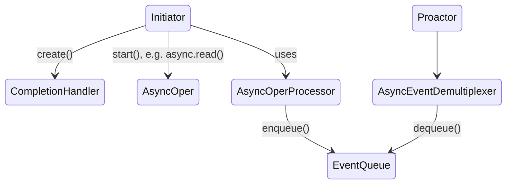
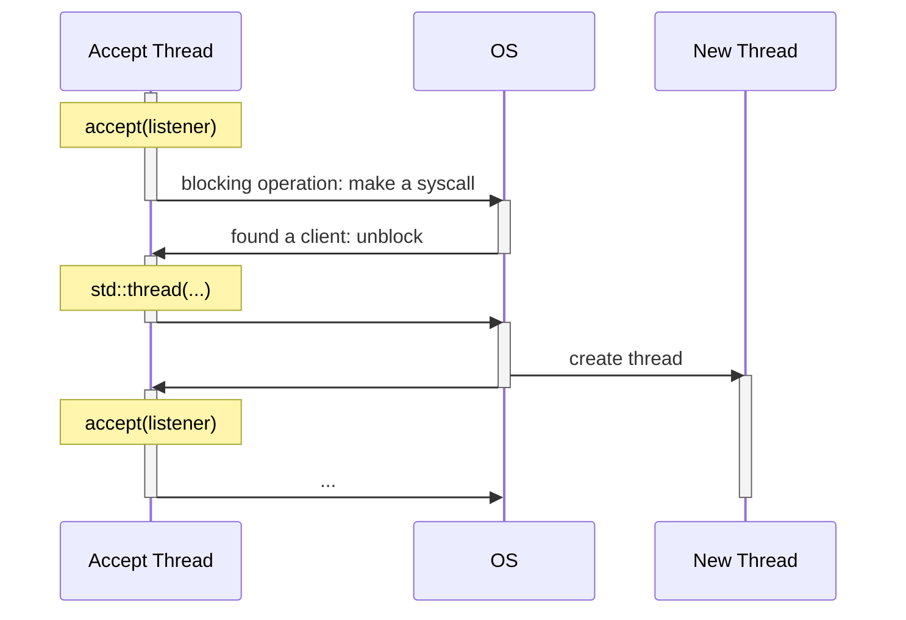
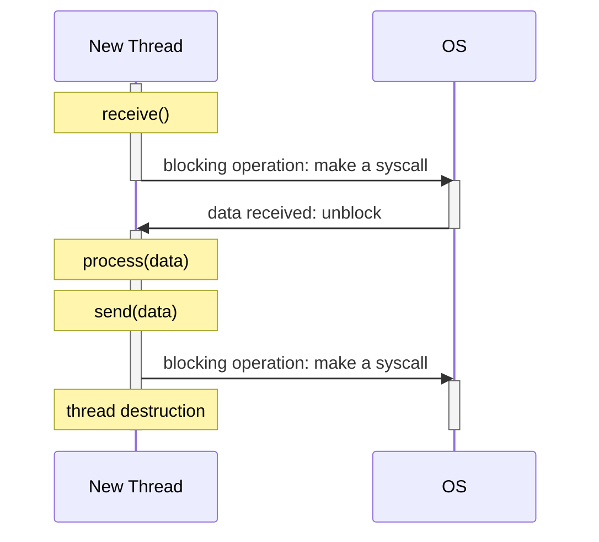

# Лекция 12

## Асинхронный ввод-вывод

Ввод-вывод бывает **блокирующим** и **неблокирующим**. Блокирующий ввод-вывод ждет, пока не придет хоть что-нибудь (и из соответствующей функции, как правило, вернется размер нагрузки), а неблокирующий просто "опрашивает" файл и, в том числе, может вернуть нулевую нагрузку. Фактически блокирующий и неблокирующий вывод отличаются друг от друга **состянием соответствующего флага в файловом дескрипторе** (на Linux `O_NONBLOCK`).

Также ввод-вывод бывает **синхронным** и **асинхронным**: при синхронном мы точно знаем, в каком месте кода каким потоком будет произведена работа с данными, а при асинхронном --- нет.

Рассмотрим на примере Boost.ASIO, как реализовывается асинхронность с классической точки зрения:



*Стрелки на схеме выражают зависимость (или использование как атрибут).*

Сущность `Initiator`, во-первых, начинает асинхронную операцию, во-вторых, создает функтор `CompletionHandler`, который должен быть передан, как аргумент начатой операции.

Есть некоторая "волшебная" сущность `AsyncOperProcessor` с высокоуровневным интерфейсом, которым пользуется `Initiator` (например, вызывает метод `async.read()`). Когда данные приходят, `AsyncOperProcessor` заполняет очередь свершившихся событий `EventQueue`. Также есть сущность `AsyncEventDemultiplexer`, которая разбирает эту очередь событий.

*Еще иногда выделяют сущность `Proactor`, которая непосредственно исполняет `CompletionHandler`, который `AsyncEventDemultiplexer` демультиплексировал.*

При этом `Initator` (вместе с `Proactor` или, если угодно, `AsyncEventDemultiplexer`) --- это **поток, созданный нами**, через который мы работаем с фреймворком. Наша собственная кодовая база содержится в `Initiator` и `CompletionHandler`.

При этом никто не запрещает `Proactor` во время выполнения хэндлера, который ему передал `AsyncEventDemultiplexer`, создать `Initiator`, который закажет новую асинхронную операцию. Поэтому в сущности `Initiator` и `Proactor` --- это один и тот же поток, выполняющий в разное время роль этих двух сущностей.

С точки зрения кода есть некоторый `ioService`; на него мы натравливаем пул потоков, которые внутри метода `run()` в бесконечном цикле опрашивают очередь событий. Кто-то извне, например, другая библиотека или наша программа, запускает сервер с помощью вызова`async_accept()` на сокете, который говорит, что если на сокет приходит клиент, то нужно вызвать `acceptHandler`. В `acceptHandler` в функции `handleAccept()` создается сессия для килента, заказывается чтение для этого клиента с помощью `startReading()` и в конце **осуществляется подписка на событие прихода нового клиента**. Внутри `startReading()` вызывается `handleRead()`, который обрабатывает пришедшие данные и снова вызывает `startReading()`.

*Вызывать `startReading()` внутри себя важно, поскольку современные сетевые протоколы, например, TCP, передают большие объемы данных по кусочкам и, чтобы не наворачивать очень сложную логику, мы последовательно обрабатываем данные от одного клиента внутри одного потока.*

Теперь подробнее про устройство `AsyncOperProcessor`. Часто внутри него создают отдельный поток, недоступный для пользователя, который в бесконечном цикле вызывает функцию-селектор (функцию-мультиплексор), например, `select`, `poll` или `epoll`, которые принимают на вход набор дескрипторов, на которые подписались инициаторы в рамках своих асинхронных вызовов (управляется во внутренней структуре данных), и возвращают массив дескрипторов, на которых произошли какие-либо события. Далее в логике происходит поиск событий, которые были запрошены инициаторами, необходимая обработка, и события в воспринимаемом фреймворком виде попадают в `EventQueue`.

На самом деле большая часть операционных систем поддерживает нативный асинхронный ввод-вывод, то есть в них вместо функции-селекторов можно использовать отдельные функции ядра ОС, с помощью которых можно подписываться на интересующие события на дескрипторах (и уже внутри логики `AsyncOperProcessor` --- структура аналогична той, что мы только что рассмотрели, но она реализована на более низком уровне). В Linux такой интерфейс называется AIO.

## Асинхронные серверы

Пусть мы пишем синхронный сервер. Вот его приблизтельная логика:
```c++
void naive_accept() {
	for (;;) {
		auto new_socket = accept(listener);
		std::thread thrd([socket = std::move(new_socket)] {
			auto data = socket.receive();
			process(data);
			socket.send(data);
		});

		thrd.detach();
	}
}
```

*Отключаться от клиента сразу после отправки данных обратно --- нормальный use case потому, что чаще всего при работе с клиентом используются stateless протоколы вроде REST.*

Производительность такого сервера будет низкой. Рассмотрим пример его работы на диаграмме:



В это время новый поток делает следующее:



Сколько всего здесь возможных переключений контекста потока? По два на каждой диаграмме --- **всего четыре штуки**; еще пять системых вызовов.

Теперь рассмотрим асинхронный сервер:

```c++
void async_accept() {
	accept(listener, [](socket_t socket) {
		// сразу заказываем следующее событие: непринципиально
		async_accept();
		socket.receive(
			// лямбда-функция будет выпонена, когда данные придут
			[socket](std::vector<unsigned char> data) {
				process(data);
				// асинхронная отправка данных
				socket.send(data, kNoCallback);
			}
		);
	});
}
```

При таком походе наш поток загружен с точки зрения вычислений настолько, насколько его нагружает поток данных. Ядро не снимается на блокирующей операции --- **детерминированных переключений контекста нет**; все операции заказываются у фреймворка, поэтому системных вызовов тоже нет (вообще правильнее сказать, что на каждую асинхронную операцию в среднем получается меньше одного системного вызова, поскольку селектор скопом обработает все дескрипторы).

*Как быть, если выполнение `CompletionHandler` занимает долгое время? Иногда в боевых системах делают два пула потоков, и задачи, занимающее долгое время, перекидываются из первого пула во второй.*

Фактически, главный минус использования асинхронного кода --- его нечитаемость. Во многом с ней помогают бороться **корутины (сопрограммы)**. Вот пример такого асинхронного кода:

```c++
coro_future coro_accept_stackles() {
	for (;;) {
		auto new_socket = co_await accept(listener);

		auto task = Async([socket = std::move(new_socket)]() -> coro_future {
			auto data = co_await socket.receive();
			process(data);
			co_await socket.send(data);
			co_return;
		});

		task.Detach();
	}
}
```

Нетрудно заметить, что он **почти не отличается от синхронного кода**.

*Ясно, что вообще в корутиновых движках мьютекс нетривиален, иначе бы поток-демультиплексор бы снимался с ядра, потом вставал бы обратно, что приводит к непроизводительности, от которой мы хотим уйти. В них мьютекс запрашивает некоторую стратегию ожидания и **начинает выполнять другие задачи внутри блокировки**.*
<!--stackedit_data:
eyJoaXN0b3J5IjpbLTMzMDE0ODc1MF19
-->
